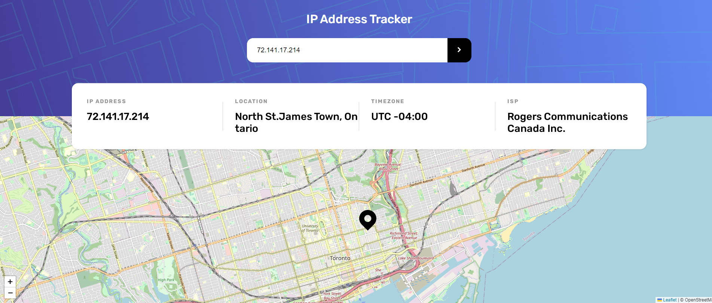
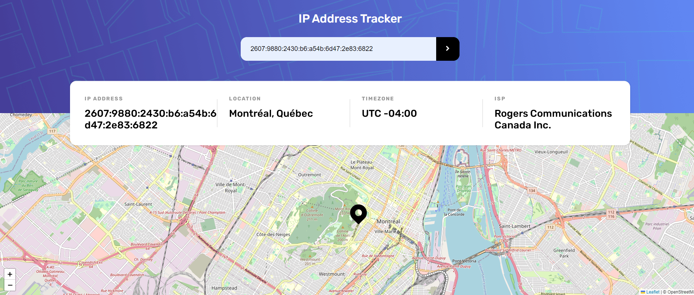
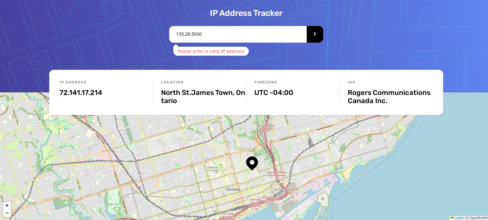

# IP address tracker

This is a solution to IP address tracker.

Users should be able to:

- View the optimal layout for each page depending on their device's screen size
- See hover states for all interactive elements on the page
- See their own IP address on the map on the initial page load
- Search for any IP addresses or domains and see the key information and location

## Table of contents

- [Overview](#overview)
  - [Link](#links)
  - [Screenshots](#screenshot)
- [My process](#my-process)
  - [Built with](#built-with)
- [Author](#author)

## Overview

### Screenshots

### Link

- Solution URL: [Add solution URL here](https://your-solution-url.com)

## My process

### Built with

- Semantic HTML5 markup
- CSS custom properties
- CSS Flexbox
- Fetch API, async and await
- [IP Geolocation API by IPify](https://geo.ipify.org/) to get the IP Address locations
- [LeafletJS](https://leafletjs.com/) To generate the map

## Author

- Website - [Xiaomin Guo](https://min-website-aislandmin.vercel.app/)
